# esp_32_ip — Real-Time Biomedical Monitoring on ESP32

> ELEC5882M MSc Individual Project · University of Leeds
> ESP32 · ESP-IDF v5.5 · FreeRTOS

A real-time biomedical monitoring platform that acquires **ECG** (AD8232 / ECG Click 5)
and **SpO₂ + heart rate** (MAX30102), processes the signals on-device, and is being
built out to stream telemetry over **WiFi → MQTT** to a cloud broker and dashboard.

The project was migrated from an earlier DE1-SoC (ARM Cortex-A9, embedded Linux,
`/dev/mem` userspace drivers) design to a bare-metal **ESP-IDF component architecture**
on FreeRTOS.

---

## System architecture

```mermaid
flowchart LR
    subgraph SENSORS [Sensors]
        ECG["AD8232 / ECG Click 5<br/>(analog ECG)"]
        PPG["MAX30102<br/>(SpO2 / HR, I2C)"]
    end

    subgraph CORE1 [Core 1 — acquisition &#40;planned pinning&#41;]
        TADC["task_ad8232<br/>ADC1 oneshot, timer-paced"]
        TMAX["task_max30102<br/>ISR &#8594; semaphore &#8594; task"]
    end

    subgraph CORE0 [Core 0 — connectivity]
        TWIFI["task_wifi_station<br/>STA + &#40;future&#41; MQTT publish"]
    end

    ECG -->|GPIO36 / ADC1_CH0| TADC
    PPG -->|"I2C @ GPIO21/22, INT GPIO25"| TMAX
    TADC -->|sample_t queue &#40;planned&#41;| TWIFI
    TMAX -->|sample_t queue &#40;planned&#41;| TWIFI
    TWIFI -->|MQTT &#40;planned&#41;| CLOUD[(Cloud broker<br/>+ dashboard)]
```



The intended runtime split is **WiFi/connectivity on core 0** and **sensor sampling on
core 1**, so radio activity cannot inject jitter into the acquisition timing. See
[Known limitations](#known-limitations--todo) — the core pinning is designed for but not
yet wired in `main.c`.

---

## Hardware

| Block | Part | Interface | Notes |
|---|---|---|---|
| MCU | ESP32 | — | Dual-core, WiFi |
| ECG front end | AD8232 (on **ECG Click 5**, mikroBUS) | Analog | Single-lead, integrated filtering + RLD |
| SpO₂ / HR | MAX30102 | I²C | Red + IR, on-chip FIFO + interrupt |

### Wiring (as configured in code)

| Signal | ESP32 pin | Source |
|---|---|---|
| ECG analog out → ADC | **GPIO36** (ADC1_CH0, mikroBUS AN) | `components/ad8232/ad8232.h` |
| ECG lead-off LO+ | **GPIO34** | `ad8232.h` |
| ECG lead-off LO− | **GPIO35** | `ad8232.h` |
| MAX30102 SDA | **GPIO21** | `components/max30102/i2c_wrapper.h` |
| MAX30102 SCL | **GPIO22** | `i2c_wrapper.h` |
| MAX30102 INT | **GPIO25** | `main/task_max30102.c` |

> **GPIO34–39 are input-only and have no internal pull resistors.** The AD8232 LOD
> outputs are push-pull CMOS, so no pulls are configured — this is intentional, not an
> omission.

---

## Repository layout

```
esp_32_ip/
├── CMakeLists.txt              # project(individual_project)
├── main/
│   ├── main.c                  # app_main: creates the three tasks
│   ├── task_ad8232.c           # ECG acquisition task
│   ├── task_max30102.c         # SpO2/HR acquisition task (ISR-driven)
│   ├── task_wifi_station.c     # WiFi bring-up + (future) MQTT publish loop
│   └── CMakeLists.txt
└── components/
    ├── ad8232/                 # ECG driver (ADC1 + lead-off)
    │   ├── ad8232.c / .h
    │   └── CMakeLists.txt
    ├── max30102/               # SpO2/HR driver
    │   ├── max30102.c / .h
    │   ├── i2c_wrapper.c / .h
    │   ├── algorithm.c / .h    # SpO2 + HR calculation (MAXREFDES117 port)
    │   └── CMakeLists.txt
    └── wifi/                   # WiFi station component
        ├── wifi_station.c / .h
        ├── Kconfig             # CONFIG_WIFI_STA_SSID / _PASSWORD
        └── CMakeLists.txt
```

---

## Prerequisites

- **ESP-IDF v5.5** with the matching toolchain
- VS Code + the **ESP-IDF extension** (recommended)
- A target ESP32 board and USB cable

> **Windows / PowerShell:** `idf.py` is only on the PATH inside an ESP-IDF-aware shell.
> Use **`ESP-IDF: Open ESP-IDF Terminal`** from the VS Code command palette, or run the
> `export.ps1` script, before invoking `idf.py`.

---

## Build, configure, flash

```bash
# 1. one-time target select
idf.py set-target esp32

# 2. set WiFi credentials (see below)
idf.py menuconfig

# 3. build, flash, watch logs
idf.py build
idf.py -p <COMx> flash monitor          # e.g. -p COM5
```

### WiFi credentials

SSID and password are Kconfig symbols, not hard-coded. In `menuconfig` they live under
**`Component config`** (because the file is named `Kconfig`, not `Kconfig.projbuild`) —
look for the **WiFi Station** menu and set:

- `CONFIG_WIFI_STA_SSID`
- `CONFIG_WIFI_STA_PASSWORD`

The station associates to WPA2 and WPA2/WPA3-transitional networks. Modem power-save is
disabled to keep RX latency low and steady (a small constant current cost) — drop that
line if you later optimise for battery life.

---

## Subsystems

### ECG — AD8232 (ADC1)
- 12-bit resolution, **12 dB attenuation** suited to the ~1.65 V mid-rail signal.
- Reads via **ADC1 oneshot** (`adc_oneshot_read`). The driver owns the single ADC unit
  handle; tasks must never re-initialise it.
- **Lead-off detection** on LO+/LO− GPIOs; `ad8232_leads_on()` reports both electrodes
  connected.
- **Status:** `ad8232.c` is currently a working template — ADC + GPIO init and a oneshot
  read. The timer-paced sampler still uses `vTaskDelay`; migration to `esp_timer` for
  jitter-free ~360 Hz sampling is pending.

### SpO₂ / HR — MAX30102 (I²C)
- I²C on **GPIO21 (SDA) / GPIO22 (SCL)**, port `I2C_NUM_0`, **100 kHz (Standard Mode)**,
  internal pull-ups enabled. *(The MAX30102 supports 400 kHz Fast Mode if you later
  raise `I2C_FREQ_HZ`.)*
- Device addresses: write `0xAE`, read `0xAF` (7-bit `0x57`).
- Sensor config: SpO₂ mode, 100 sps, 400 µs pulse width, FIFO almost-full = 17.
- **ISR-driven:** the active-low `INT` pin (GPIO25, falling edge) gives a binary
  semaphore from the ISR, unblocking the task. A **500-sample buffer** holds a 5 s
  window; each cycle shifts in 100 fresh samples and keeps 400.
- **Status:** acquisition chain working.

### WiFi station
- Event-group synchronisation (`WIFI_CONNECTED_BIT`); reconnect logic with retry
  counting on disconnect, bit set on `IP_EVENT_STA_GOT_IP`.
- NVS initialised (with erase-on-version-mismatch fallback) before WiFi start.
- **Status:** STA connection working. The publish loop contains the
  `// mqtt function to be done here` placeholder — this is the next milestone.

---

## Design decisions (the *why*)

- **ADC1, never ADC2.** ADC2 is unavailable while WiFi is active, so all analog
  acquisition is locked to ADC1.
- **Driver owns the peripheral handle.** Dual init of the same I²C or ADC handle aborts
  with `ESP_ERR_INVALID_STATE`; tasks call into the driver, they don't re-init it.
- **ISR-driven vs timer-paced.** The MAX30102 is digital with a FIFO and interrupt, so
  it uses ISR → semaphore → task. The AD8232 is a free-running analog output, so it needs
  timer-paced polling. These two patterns are kept strictly separate.
- **Core affinity is a correctness concern, not a nicety.** For biomedical data, isolating
  sampling (core 1) from the WiFi stack (core 0) protects signal integrity. Using plain
  `xTaskCreate` silently drops that isolation.
- **Nyquist for ECG.** The board's bandpass ceiling is ~40 Hz; ~360 Hz sampling sits well
  above the minimum and gives headroom for HRV and spectral analysis.
- **Filter corners are design targets.** Values derived from AD8232 component values carry
  tolerance — treat them as design intent, not measured ground truth.

---

## Project status & roadmap

**Working**
- [x] MAX30102 SpO₂/HR acquisition (ISR-driven, FIFO, 5 s window)
- [x] AD8232 ECG analog acquisition + lead-off detection (ADC1 oneshot)
- [x] WiFi STA connection with event-group sync and reconnect

**In progress / next**
- [ ] Pin sensor tasks to core 1, WiFi to core 0 (`xTaskCreatePinnedToCore`)
- [ ] Capture a **baseline jitter measurement** before adding MQTT load
- [ ] Migrate ECG sampler from `vTaskDelay` to `esp_timer`
- [ ] Define `sample_t` + a FreeRTOS **producer/consumer queue** (sensors → publish task)

**Planned**
- [ ] `esp-mqtt` client in the WiFi task; prove against a local Mosquitto on 1883
- [ ] Local buffering / offline data handling, flush on reconnect
- [ ] TLS (MQTTS 8883) — WPA2 link layer + TLS application layer
- [ ] Cloud dashboard and end-to-end evaluation (latency / data integrity metrics)

---

## Known limitations / TODO

- **`main.c` uses plain `xTaskCreate`** — the core-0/core-1 split is designed for but not
  yet active. This is the recommended next commit.
- **ECG sampling is paced by `vTaskDelay`**, which is not jitter-free; `esp_timer` is the
  production path.
- **The MAX30102 driver uses the legacy `driver/i2c.h` API** (`i2c_param_config` /
  `i2c_cmd_link_*`). It works, but ESP-IDF v5.x prefers the newer `driver/i2c_master.h`
  bus/device model — a candidate for future cleanup.
- **No MQTT / TLS yet** — telemetry transport is the open milestone.

---

## References

- AD8232 Single-Lead Heart Rate Monitor Front End — datasheet (Analog Devices)
- MAX30102 High-Sensitivity Pulse Oximeter / Heart-Rate Sensor — datasheet (Maxim)
- ECG Click 5 schematic & documentation (MikroElektronika)
- MAXREFDES117# reference design (basis for the SpO₂/HR algorithm)

---

## Academic note

ELEC5882M MSc Individual Project, University of Leeds. Any use of generative AI in the
preparation of associated reports is referenced per University guidance.


# Development Log — MAX30102 Vitals Pipeline (ESP32 / ESP-IDF)

A record of the real bugs, root causes, and engineering principles learned while
bringing up the MAX30102 heart-rate / SpO₂ path, from raw garbage readings all the
way to a working ThingsBoard dashboard.

The most valuable thing here is not the fixes — it is the *method* of finding them.

---

## Table of Contents

1. [Concurrency: Race Conditions](#1-concurrency-race-conditions)
2. [Concurrency: Atomicity](#2-concurrency-atomicity)
3. [The "Two Correct Halves" Bug Family](#3-the-two-correct-halves-bug-family)
4. [Measure Before You Reason (and Trust the Right Measurement)](#4-measure-before-you-reason)
5. [Hidden Contracts Between Modules](#5-hidden-contracts-between-modules)
6. [Signal Quality vs. Algorithm](#6-signal-quality-vs-algorithm)
7. [Data Integrity: Gating and Fail-Safe](#7-data-integrity-gating-and-fail-safe)
8. [The Observer Effect in Instrumentation](#8-the-observer-effect-in-instrumentation)
9. [Register Configuration Discipline](#9-register-configuration-discipline)
10. [Debugging Method Summary](#10-debugging-method-summary)

---

## 1. Concurrency: Race Conditions

**Definition.** A *race condition* is when the correctness of a program depends on
the order in which two things happen, but that order is not guaranteed — it is
decided by the scheduler. If A must finish before B, but nothing *forces* it, you
are gambling.

### Case encountered: event group / queue used before it was created

Symptom: hard crash on boot.

```
assert failed: xEventGroupWaitBits event_groups.c:345 (xEventGroup)
```

The backtrace pointed straight at the line:

```
task_tb_mqtt -> wifi_station_wait_connected -> xEventGroupWaitBits (crashed)
```

Root cause: the WiFi event group was created *inside* `task_wifi_station`
(`wifi_station_init()` was the task's first line). The consumer task
`task_tb_mqtt` could be scheduled first and call `wifi_station_wait_connected()`
while the event group was still `NULL`.

The same pattern applied to `telemetry_init()` (which creates the shared queues):
it was being called *inside* the producer task `task_max30102`, but the consumer
`task_tb_mqtt` also depends on those queues.

### The wrong fix vs. the right fix

- **Wrong fix:** raise the WiFi task's priority so it "usually runs first."
  This does not remove the race — it only lowers the probability of hitting it.
  A guaranteed crash becomes an *intermittent* crash, which is far harder to debug.
- **Right fix:** eliminate the race by enforcing order. Move initialization of all
  **shared resources** out of any single task and into `app_main`, *before* any
  `xTaskCreate`. Code in `app_main` runs synchronously, before the scheduler starts,
  so by the time any task runs, the resource is guaranteed to exist.

### Principle: who owns a shared resource?

> If a resource is shared by tasks X and Y, its creation belongs to neither X nor Y —
> it belongs to their common parent (`app_main`). Whichever task you put it in, the
> *other* one can run first.

### Two-phase startup pattern (the fix)

```c
void app_main(void)
{
    // Phase 1: create ALL shared resources synchronously, before any task exists.
    ESP_ERROR_CHECK(telemetry_init());     // creates the queues
    ESP_ERROR_CHECK(wifi_station_init());  // creates the event group, starts WiFi

    // Phase 2: create tasks. Every shared resource is now guaranteed ready.
    xTaskCreate(task_max30102,      "task_max30102",      4096*2, NULL, 5, NULL);
    xTaskCreate(task_wifi_station,  "task_wifi_station",  4096*2, NULL, 5, NULL);
    xTaskCreate(task_tb_mqtt,       "task_tb_mqtt",       4096*2, NULL, 5, NULL);
}
```

**Takeaway:** order dependencies must be solved with *order guarantees* (correct
placement / synchronization), never with priority tuning or delays. Tuning priority
is betting; two-phase startup is insurance.

---

## 2. Concurrency: Atomicity

**Definition.** An operation is *atomic* if it completes entirely in one
indivisible step — there is no observable "half-done" intermediate state. The word
comes from "indivisible."

### Where it appears in this project

Two counters are accessed from more than one task:

```c
static uint16_t s_vital_sample_rejection = 0;  // written by sensor task, read by MQTT task
static uint32_t s_ecg_sample_drop        = 0;  // same idea
```

`s_vital_sample_rejection++` *looks* like one action, but at the CPU level it is
three steps — a **read-modify-write**:

1. load the value from memory into a register
2. increment the register
3. store the result back to memory

Between those steps, the scheduler can switch tasks.

### Why this code is nevertheless safe

Two facts make it safe *without* a lock:

1. **Single writer.** `++` is called from exactly one task (`task_max30102`). The
   classic "two tasks both increment and lose a count" race needs *two* writers.
2. **Aligned ≤32-bit read is atomic on this target.** The MQTT task only *reads*
   the counter. On the 32-bit ESP32, reading a naturally-aligned variable of ≤32
   bits is a single instruction, so the reader can never observe a *torn* value
   (half-new, half-old).

### Where it would STOP being safe (the important boundary)

- **Widen to `int64_t`** (e.g. an epoch timestamp): a 64-bit read/write on a 32-bit
  core takes *two* instructions, so the reader can observe a torn value (high half
  new, low half old). → needs a lock or atomic type.
- **Add a second writer:** the "read 5, both add 1, both write 6" lost-update race
  reappears. → needs protection.

### The mature move: document the assumption in code

```c
/* Cross-task counter: single writer (sensor task), single reader (MQTT task).
 * uint16_t read/write is atomic on this 32-bit target, so no lock needed.
 * NOTE: if widened to 64-bit or given a second writer, add protection. */
```

**Takeaway:** the value of this analysis is not the code — it is being able to say
"I know this is shared across tasks, and I have *reasoned* about why it is safe,"
rather than "I didn't think about concurrency." Knowing when you *can* skip a lock
shows more maturity than reflexively locking everything.

---

## 3. The "Two Correct Halves" Bug Family

The single most recurring bug type in this project: each half is individually
correct, but the *seam* between them is wrong. The compiler often does not catch it.

Instances actually hit:

| Where | The two "correct" halves | The broken seam |
|-------|--------------------------|-----------------|
| Sampling | sensor produces data / algorithm consumes it | 100 Hz vs 200 Hz timing contract |
| ISR gap logging | ISR writes `gap_log` / main loop reads it | two same-named variables (shadowing) → different memory |
| Function name | function defined `telemetry_init()` / call site `ESP_telemetry_init()` | names don't match → link error |
| Format string | `%s %ld %s %ld` placeholders / the arguments | argument order didn't match placeholder order |
| Plausibility gate | SpO₂ lower-bound check / the macro used | used `LOW_LIMIT_HR_VALUE` for an SpO₂ check (copy-paste) |
| Telemetry keys | firmware sends `"HeartRate"` / widget key `HeartRate` | any mismatch → dashboard shows nothing, silently |

### Defenses that worked

- **Align similar lines vertically** and scan them — mismatches jump out.
- **Type a `{` and immediately type its `}`**, then fill the middle → brackets never
  unbalanced.
- **A single source of truth for cross-boundary names** (a "key contract" comment
  listing every telemetry key that firmware and dashboard must agree on).
- **Turn on compiler warnings** (`-Wall`, `-Wformat`, `-Wreturn-type`). Several of
  these are caught automatically once warnings are on. "Compiles" ≠ "correct."

**Takeaway:** when two components each look right but the whole is wrong, suspect the
connection between them, not the halves.

---

## 4. Measure Before You Reason

The biggest lesson of the whole effort.

### The measurement itself can lie — verify the instrument first

We chased the "sampling rate" bug through several wrong-but-reasonable hypotheses
(A_FULL interrupt, pull-up, double-triggering) because we trusted a per-second
counter (`isr/s`, `read/s`) that turned out to be **systematically wrong** (a dirty
1-second window inflated the count). The truth only appeared when we printed the
**raw inter-interrupt gap** — the closest-to-physical, least-processed number.

- `HRvalid = 1` does **not** mean the HR is correct — only that a number was produced.
- `isr/s = 300` did **not** mean 300 interrupts — the counter was miscounting.
- The raw `gap ≈ 5000 µs` was the ground truth that pinned the rate at 200 Hz.

> Summaries can lie. Raw data does not. When two summary statistics contradict each
> other, go back to the un-aggregated raw data instead of adding a third statistic.

### Pick the measurement with the highest information content

Raw gap values instantly separated "uniform 200 Hz" from "paired glitch triggering."
A single well-chosen measurement (the gap) resolved a question that several code
changes could not.

### Diagnosis → Treatment → Verification (never skip a step)

Skipping diagnosis and jumping to a fix ("just try changing X") caused several
detours. The correct order:

1. **Diagnose** — measure to locate the root cause.
2. **Treat** — change only the thing the evidence points to.
3. **Verify** — measure again to confirm the root cause is gone.

Skipping step 1 is "trying your luck." Skipping step 3 is "thinking it's fixed."

### Prefer light tools before heavy ones

Software counters < raw-data printing < logic analyzer / oscilloscope. Start with
the lightest tool and escalate only when the lighter one cannot explain the result.
Reaching for the oscilloscope first often over-complicates a simple problem.

---

## 5. Hidden Contracts Between Modules

The Maxim algorithm hard-codes its sampling assumption:

```c
#define FS 100                 // algorithm.h
#define BUFFER_SIZE (FS * 5)   // 500 samples = 5 s ONLY at 100 Hz
// HR = 6000 / peak_interval   // 6000 = FS * 60
```

This is a **timing contract**: "you promise to feed me samples at exactly 100 Hz."
It lives in a *different file* from the sensor driver. Porting the reader without
honoring 100 Hz silently broke HR, with no compile error.

Root cause of the wrong rate: `SPO2_CONFIG = 0x2A` selected 200 Hz
(`SPO2_SR = 010`), not 100 Hz (`SPO2_SR = 001` → `0x27`). Register value looked
deliberate and the datasheet confirmed it — the mistake was the *mismatch* between
the register and the algorithm's `FS`.

**Fix chosen:** set the sensor back to 100 Hz (`0x27`) so hardware and algorithm
agree, and record the contract in a header comment so future edits keep them in sync.

**Takeaway:** a module's correctness can silently depend on a numeric contract
declared somewhere else. When you change one side, change the other — and document
the dependency.

---

## 6. Signal Quality vs. Algorithm

After the sampling rate was fixed, HR was *still* wrong. A second root cause was
hiding behind the first.

- **One bug can mask another.** You cannot see the second until the first is fixed.
- The remaining issue was **signal quality**, measured directly from the raw waveform.

**Perfusion Index (PI)** = AC / DC of the IR channel — how strong the pulsatile
(heartbeat) component is relative to the baseline:

| Finger placement | IR peak-to-peak (AC) | IR baseline (DC) | PI      | Result       |
|------------------|----------------------|------------------|---------|--------------|
| Poorly placed    | ~600                 | ~137,400         | ~0.44 % | HR = garbage |
| Placed properly  | ~2,530               | ~139,700         | ~1.8 %  | HR = 65 ✓    |

Healthy PI is roughly 1–5 %. The *only* change between the two rows was **how the
finger was placed** — no code changed. Physical contact quality is part of the
system, and often the weakest link.

**Takeaway:** when a biosignal result looks wrong, go back to the *raw waveform* and
measure its SNR / perfusion index. Any summary output can deceive you; the raw
waveform cannot.

---

## 7. Data Integrity: Gating and Fail-Safe

The request was originally "write a noise-removal algorithm." The data showed the
correct approach was different.

### Rejection, not smoothing

The bad data was not "noise on top of a good signal" — it was *good stretches and
garbage stretches interleaved*. Smoothing would average `500` and `88` into a
plausible-looking but *fabricated* number.

> A smooth fake number is more dangerous than a jumpy real one: jumpiness warns you
> the signal is bad; smoothness lies that everything is fine.

The real data drew its own threshold: good HR sat below ~80, garbage HR sat above
~150, with an empty gap in between. **Let the data define the threshold**, informed
by the use case — not a guessed number.

### Two-stage gate (pure function)

```c
bool vitals_is_plausible(int32_t spo2_d, int32_t hr_d, int8_t spo2_v, int8_t hr_v)
{
    if (spo2_v != 1 || hr_v != 1) { return false; }           // 1) trust the valid flag...
    if (hr_d   > HIGH_LIMIT_HR_VALUE || hr_d   < LOW_LIMIT_HR_VALUE ||
        spo2_d > HIGH_LIMIT_SP_VALUE || spo2_d < LOW_LIMIT_SP_VALUE) { return false; }
    return true;                                              // 2) ...but ALSO physiological range
}
```

Why *both* checks: real data showed `HR=375, valid=1, SpO2=94, valid=1` — a garbage
HR that passed the valid flag. The `valid` flag alone is not enough.

Design notes:
- Kept it a **pure function** (no side effects) so it is unit-testable off-hardware.
- Lives in the **telemetry layer**, not the driver — the driver stays a pure data
  mover; quality judgement belongs one layer up. Named `vitals_is_plausible`, not
  `max30102_*`, so the chip name does not leak into the API.

### Fail-safe publishing

When a reading fails the gate, publish **nothing** — do not push a `0` and do not
re-push the last value. `0` is dangerous (HR = 0 means cardiac arrest); a stale
value silently pretends the signal is still good. Respecting the queue's dequeue
return value (only publish when new valid data exists) is most of the fix.

> In medical/physiological monitoring, "I currently have no trustworthy data" is
> itself important information — report it honestly instead of masking it with a
> stale value or a zero.

### Rejection count as a Data-Integrity metric

`rejected_count` is exposed via a getter (mirroring the ECG drop counter) and
published every cycle as its own telemetry key, so the "how much are we discarding"
metric is always visible — not only while data is being dropped.

---

## 8. The Observer Effect in Instrumentation

*Probe effect:* the way you measure something changes the thing you measure.

A per-sample `printf` at 115200 baud takes ~6 ms per line, but a 100 Hz sample
period is only 10 ms. Two prints per sample exceeded the sample interval, so the
task fell behind, the binary semaphore saturated (max count 1 → missed wake-ups),
and the fed-in signal became stale — corrupting the very timing we were trying to
measure.

Rules that followed:
- Keep slow operations (`printf`) **out of the hot path** (the per-sample loop).
- Report **once per second**, not per sample; a counter `++` (a few ns) is fine in
  the hot path, a `printf` is not.
- If you must instrument timing, do not use a tool that destroys timing.

---

## 9. Register Configuration Discipline

- **"Value is set" ≠ "behavior is correct."** `INTR_ENABLE_1 = 0xC0` deliberately
  enabled two interrupt sources (`A_FULL` + `PPG_RDY`). Each bit was intentional and
  datasheet-correct, but the *combination* produced unintended interrupt timing.
  Setting `0x40` (PPG_RDY only) matches the one-sample-per-interrupt read pattern.
- **Decode bitfields against the datasheet by hand.** Splitting `0x27` /
  `0x2A` into `SPO2_ADC_RGE | SPO2_SR | LED_PW` and cross-checking the sample-rate
  table (Table 6) was what confirmed the real rate. Decoding a register does not
  prove it right — it *rules a suspect in or out*, so you stop wasting time in the
  wrong place.
- **Hardware facts matter.** The module board carries an INT pull-up (R2), so the
  open-drain INT line was already electrically fine — proven by *uniform* interrupt
  gaps (no glitches). "Open-drain needs a pull-up" is correct in principle but was
  **not** the cause of the bug. *Being right in principle ≠ being the current root
  cause.*

---

## 10. Debugging Method Summary

A distilled checklist, earned the hard way:

1. **Split the problem in half** and prove which half is guilty (signal vs. algorithm,
   hardware vs. timing, logic vs. data).
2. **Measure — and verify the instrument itself.** Summaries lie; raw data does not.
3. **Pick the highest-information measurement** (raw gaps, raw waveform), not another
   summary.
4. **Diagnose → treat → verify.** Never jump to a fix before diagnosis; never assume
   fixed without re-measuring.
5. **Light tools before heavy tools.** Counter → raw print → scope.
6. **One bug can mask another** — fixing one and revealing the next is normal progress.
7. **"Correct in principle" ≠ "current root cause."**
8. **When two halves each look right but the whole is wrong, suspect the seam.**
9. **Fail safe** — no data beats fake data.
10. **Write your assumptions into the code** (concurrency, contracts, known
    limitations) — that note is for the future you.

### Pre-commit self-check (to internalize)

Before flashing, scan the diff against:

- [ ] Names match across files (functions, macros, telemetry keys)?
- [ ] Any variable declared but never used?
- [ ] Every return value meaningful; every function signature honest?
- [ ] Format specifiers match argument types and count/order?
- [ ] Did this change "collaterally" touch something it shouldn't?
- [ ] Did I address **every** point raised, not just the most visible one?

---

## Known Limitations (accepted, revisit if time permits)

- **Stale vitals on signal loss.** The depth-1 overwrite queue keeps the last valid
  value; when samples are being rejected, no new value replaces it. A timestamp /
  freshness check (`ts_ms` in `max_vitals_t`, consumer-side age check) would let the
  system signal "signal lost" instead of holding the last value. Deferred.
- **HR upper limit (180 bpm).** Set with margin for exertion; for a resting-monitor
  use case it could be tightened (real data showed garbage clustering above ~150).
- Counters rely on ≤32-bit aligned atomic access; would need locking if widened to
  64-bit or given a second writer.