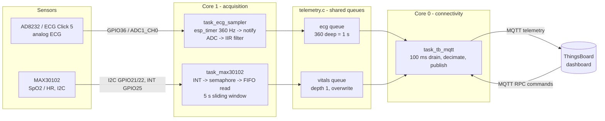

# esp_32_ip — Real-Time Biomedical Monitoring on ESP32

> ELEC5882M MSc Individual Project · University of Leeds
> ESP32 · ESP-IDF v5.5 · FreeRTOS · ThingsBoard

A real-time biomedical monitoring platform. It acquires **single-lead ECG**
(AD8232 / ECG Click 5) at 360 Hz and **SpO₂ + heart rate** (MAX30102) at 100 Hz,
filters and validates the signals on-device, and streams them over **WiFi → MQTT**
to a **ThingsBoard** cloud dashboard. The dashboard can also send commands back to
the device (server-side RPC) to power sensors on and off.

The end-to-end path is working: sensors → FreeRTOS queues → MQTT → live cloud charts,
with two-way control.

---

## Contents

- [esp\_32\_ip — Real-Time Biomedical Monitoring on ESP32](#esp_32_ip--real-time-biomedical-monitoring-on-esp32)
  - [Contents](#contents)
  - [System architecture](#system-architecture)
  - [Hardware](#hardware)
    - [Wiring (as configured in code)](#wiring-as-configured-in-code)
  - [Repository layout](#repository-layout)
  - [Build, configure, flash](#build-configure-flash)
    - [Configuration (menuconfig)](#configuration-menuconfig)
  - [Subsystems](#subsystems)
    - [ECG — AD8232 (ADC1 + `esp_timer`)](#ecg--ad8232-adc1--esp_timer)
    - [SpO₂ / HR — MAX30102 (I²C)](#spo--hr--max30102-ic)
    - [Telemetry queues (`telemetry.c`)](#telemetry-queues-telemetryc)
    - [MQTT publisher — `task_tb_mqtt`](#mqtt-publisher--task_tb_mqtt)
    - [Timebase — `timebase.c`](#timebase--timebasec)
  - [Cloud interface (ThingsBoard)](#cloud-interface-thingsboard)
  - [Design decisions (the *why*)](#design-decisions-the-why)
  - [Evaluation \& instrumentation](#evaluation--instrumentation)
  - [Known limitations / TODO](#known-limitations--todo)
  - [Development log](#development-log)
  - [References](#references)
  - [Academic note](#academic-note)

---

## System architecture



**Runtime split.** Acquisition runs on **core 1**, the WiFi/MQTT stack on **core 0**,
so radio activity cannot inject jitter into sampling timing. The split is a compile-time
switch (`ECG_PINNED_CORE1` in `components/latency/test_config.h`) so the *pinned* and
*unpinned* cases can be measured against each other — see
[Evaluation & instrumentation](#evaluation--instrumentation).

---

## Hardware

| Block | Part | Interface | Notes |
|---|---|---|---|
| MCU | ESP32 (Xtensa, dual-core) | — | WiFi, FreeRTOS tick = 100 Hz |
| ECG front end | AD8232 on **ECG Click 5** (mikroBUS) | Analog | Single-lead, integrated filtering + RLD |
| SpO₂ / HR | MAX30102 | I²C | Red + IR LEDs, on-chip FIFO + interrupt |

### Wiring (as configured in code)

| Signal | ESP32 pin | Defined in |
|---|---|---|
| ECG analog out → ADC | **GPIO36** (ADC1_CH0, mikroBUS AN) | `components/ad8232/ad8232.h` |
| ECG lead-off LO+ | **GPIO34** | `ad8232.h` |
| ECG lead-off LO− | **GPIO35** | `ad8232.h` |
| ECG shutdown SDN | **GPIO26** | `ad8232.h` |
| MAX30102 SDA | **GPIO21** | `components/max30102/i2c_wrapper.h` |
| MAX30102 SCL | **GPIO22** | `i2c_wrapper.h` |
| MAX30102 INT | **GPIO25** | `main/task_max30102.c` |

> **GPIO34–39 are input-only** on the ESP32 and have no internal pull resistors.
> LO+/LO− are inputs, so they are fine there. `SDN` is an **output** and therefore must
> *not* live in that range — it is on GPIO26. Putting it on GPIO39 fails silently:
> the code runs, the pin never drives.

---

## Repository layout

```
esp_32_ip/
├── CMakeLists.txt                  # project(individual_project)
├── sdkconfig                       # committed so builds are reproducible
├── main/
│   ├── main.c                      # app_main: init shared resources, then create tasks
│   ├── task_ad8232.c               # ECG: esp_timer 360 Hz -> sampler task
│   ├── task_max30102.c             # SpO2/HR: INT-driven acquisition + algorithm
│   ├── task_tb_mqtt.c              # single MQTT publisher (ECG + vitals)
│   ├── telemetry.c / .h            # shared queues, drop/skip/rejection counters
│   ├── timebase.c / .h             # SNTP wall clock + monotonic esp_timer anchor
│   └── task_stack_monitor.c        # optional: periodic stack high-water-mark report
├── components/
│   ├── ad8232/                     # ECG driver
│   │   ├── ad8232.c / .h           #   ADC1 oneshot, lead-off, SDN standby
│   │   └── ecg_filter.c / .h       #   cascaded IIR biquads (HP 0.5 / notch 50 / LP 40)
│   ├── max30102/                   # SpO2/HR driver
│   │   ├── max30102.c / .h
│   │   ├── i2c_wrapper.c / .h
│   │   └── algorithm.c / .h        #   MAXREFDES117# port
│   ├── tb_mqtt/                    # ThingsBoard MQTT client
│   │   ├── tb_mqtt_client.c / .h   #   telemetry publish + RPC dispatch
│   │   └── Kconfig                 #   CONFIG_MQTT_BROKER_URI / CONFIG_TB_ACCESS_TOKEN
│   ├── wifi/                       # WiFi station (event-group synchronised)
│   │   └── Kconfig                 #   CONFIG_WIFI_STA_SSID / _PASSWORD
│   └── latency/
│       ├── latency.c / .h          # internal-latency + PUBACK RTT instrumentation
│       └── test_config.h           # ★ all experiment switches live here
└── test/                           # host-side capture + analysis (Python)
    ├── ecg_jitter_cap.py           # serial -> .txt capture
    ├── analyze_jitter.py           # pinned vs unpinned jitter, box plot
    ├── analyze_latenecy.py         # internal latency + RTT percentiles
    ├── analyze_skip.py             # data loss per minute vs publish period
    ├── stack_monitor.py            # stack high-water-mark analysis
    └── *.txt / *.png               # raw captures and generated figures
```

---

## Build, configure, flash

**Prerequisites:** ESP-IDF **v5.5** and its toolchain; VS Code + the Espressif
extension (recommended); an ESP32 board and USB cable.

```bash
# 1. one-time target select
idf.py set-target esp32

# 2. set WiFi credentials and ThingsBoard token
idf.py menuconfig

# 3. build, flash, watch logs
idf.py build
idf.py -p <COMx> flash monitor          # e.g. -p COM5
```

> **Windows / PowerShell:** `idf.py` is only on the PATH inside an ESP-IDF-aware shell.
> Use **`ESP-IDF: Open ESP-IDF Terminal`** from the VS Code command palette, or run
> `export.ps1` first.

### Configuration (menuconfig)

Both config files are named `Kconfig` (not `Kconfig.projbuild`), so their menus appear
under **`Component config`**:

| Menu | Symbol | Purpose |
|---|---|---|
| WiFi STA Configuration | `CONFIG_WIFI_STA_SSID` | Access point name |
| | `CONFIG_WIFI_STA_PASSWORD` | Access point password |
| ThingsBoard MQTT Client Configuration | `CONFIG_MQTT_BROKER_URI` | e.g. `mqtt://mqtt.eu.thingsboard.cloud:1883` |
| | `CONFIG_TB_ACCESS_TOKEN` | Device access token from ThingsBoard |

Credentials are **not** hard-coded in source. Nothing secret is committed.

---

## Subsystems

### ECG — AD8232 (ADC1 + `esp_timer`)

- **Pacing:** a periodic `esp_timer` fires every **2778 µs (360 Hz)**. Its callback does
  one job only — `vTaskNotifyGiveFromISR()` to wake the sampler task. All real work
  (ADC read, filtering, queueing) happens in task context.
- **Acquisition:** ADC1 oneshot, **12-bit**, **12 dB attenuation** (suits the ~1.65 V
  mid-rail signal). The driver owns the single ADC unit handle; tasks never re-init it.
- **Lead-off gating:** `ad8232_leads_on()` is checked every sample. When an electrode
  falls off, acquisition pauses and logs the transition **once** (edge-triggered, not
  level-triggered) instead of spamming the log at 360 Hz.
- **Digital filtering** (`ecg_filter.c`): three cascaded second-order IIR biquads —

  ```
  raw ADC → [ high-pass 0.5 Hz ] → [ notch 50 Hz, Q=30 ] → [ low-pass 40 Hz ] → filtered
              baseline wander        UK mains hum            EMG / muscle noise
  ```

  The 0.5–40 Hz pass-band matches the diagnostic ECG bandwidth in the AAMI/IEC
  standards. **Coefficients are computed at run time from `fs`**, not hard-coded, so
  switching between 360 Hz and 180 Hz stays correct. The high-pass removes the ~2048-count
  DC bias, so the result is re-centred by +2048 before display.
- **Standby:** the SDN pin (GPIO26) puts the AD8232 into low-power standby; the sampling
  timer is stopped at the same time.

### SpO₂ / HR — MAX30102 (I²C)

- I²C on **GPIO21/GPIO22**, port `I2C_NUM_0`, **100 kHz**, with the module's own INT pull-up.
- **Interrupt-driven:** the active-low INT pin falls when a sample is ready →
  `xSemaphoreGiveFromISR()` → task wakes and reads the FIFO. The INT line is only
  released when the interrupt status register is read, so that read is mandatory —
  skipping it deadlocks the edge interrupt.
- **Sliding window:** 500 samples @ 100 sps = a **5 s** window. Each cycle drops the
  oldest 100 samples and reads 100 new ones, so results refresh about once per second.
- **Timing contract:** the Maxim algorithm hard-codes `FS = 100` and computes HR as
  `6000 / peak_interval`. The sensor's `SPO2_SR` **must** therefore be 100 Hz, and
  `BUFFER_SIZE` / `FS` must stay in agreement. Change one, change the other.
- **Plausibility gate** (`vitals_is_plausible()`, in `telemetry.c`): a pure function that
  rejects a result unless both validity flags are 1 **and** HR ∈ [30, 150] bpm and
  SpO₂ ∈ [90, 100] %. Rejected samples are counted, never smoothed or interpolated —
  see [Design decisions](#design-decisions-the-why).

### Telemetry queues (`telemetry.c`)

| Queue | Depth | Policy | Reason |
|---|---|---|---|
| ECG | 360 (= 1 s @ 360 Hz) | `xQueueSendToBack(..., 0)` — never blocks; on full, drop + count | The 2.78 ms sampler must never be blocked by a slow network |
| Vitals | 1 | `xQueueOverwrite()` — newest wins | An old SpO₂ reading has no value; only the freshest matters |

Three integrity counters are maintained and published to the dashboard:

- `telemetry_ecg_drop_count()` — sample lost because the **queue was full**
- `telemetry_ecg_network_skip_count()` — sample not queued because **MQTT was down**
- `telemetry_vitals_rejection_count()` — vitals result **failed the plausibility gate**

Separating these matters: "we lost data" is not a diagnosis; *which* of the three
counters moved tells you whether the fault is CPU, network, or signal quality.

### MQTT publisher — `task_tb_mqtt`

One task owns the MQTT client, so ECG and vitals can never race on it. Each 100 ms cycle:

1. **Drain** the ECG queue completely (up to 400 points) — protects the queue from overflow.
2. **Decimate** by **4** → ~90 points/s actually transmitted. The network, not the CPU,
   is the bottleneck: at full 360 Hz the esp-mqtt outbox grows faster than the broker
   can ACK, and the heap eventually runs out.
3. **Chunk** into batches of 40 and publish as a ThingsBoard JSON array with explicit
   per-sample timestamps: `[{"ts":<epoch_ms>,"values":{"ECG":<value>}}, ...]`.
4. Once every 10 cycles (**1 s**), publish vitals, or the rejection count if no fresh
   vitals arrived.

### Timebase — `timebase.c`

ThingsBoard needs **wall-clock epoch milliseconds**, but a wall clock is not monotonic —
SNTP can step it. Samples are therefore timestamped with the **monotonic**
`esp_timer_get_time()`, and converted at publish time using a single anchor pair
(`s_anchor_epoch_ms`, `s_anchor_us`) captured once after SNTP sync.

`timebase_is_valid()` is checked in the **MQTT consumer**, not at task creation, so
acquisition still runs when there is no network — only the upload waits.

---

## Cloud interface (ThingsBoard)

**Uplink** — topic `v1/devices/me/telemetry`, QoS 1 (PUBACK logged):

| Key | Rate | Meaning |
|---|---|---|
| `ECG` | ~90 pts/s | Filtered ECG, with per-sample `ts` |
| `HeartRate` | 1 Hz | bpm |
| `SpO2` | 1 Hz | % |
| `MaxRejectionCount` | 1 Hz | Cumulative implausible-vitals count |

**Downlink** — server-side RPC on `v1/devices/me/rpc/request/+`, each answered on the
matching `.../response/<id>` topic:

| Method | Params | Effect |
|---|---|---|
| `setEcgPower` | `true` / `false` | AD8232 standby + start/stop the 360 Hz timer |
| `setSpo2Power` | `true` / `false` | MAX30102 shutdown / wake (+ buffer cold start) |
| `runSection` | `true` / `false` | Start / stop pushing ECG into the queue |

RPC handlers are declared `__attribute__((weak))` in `tb_mqtt_client.c` and overridden by
the real implementations in the task files. This keeps the MQTT component independent of
the sensor components — it compiles and links on its own, which makes it testable in
isolation.

---

## Design decisions (the *why*)

- **Initialise shared resources in `app_main`, before any task is created.**
  Event groups and queues used by more than one task are created synchronously, before
  the scheduler can interleave anything. Raising a task's priority so it "usually runs
  first" is not a fix — it converts a guaranteed crash into an intermittent one, which is
  far worse.
- **One owner per shared resource.** Only `task_tb_mqtt` touches the MQTT client. Only the
  sampler writes the ECG queue. Shadow copies of state (a second variable mirroring the
  truth) are treated as a bug, not a convenience.
- **The ISR does the minimum.** Both fast paths (`esp_timer` callback, MAX30102 INT) only
  signal a task. Nothing that can block, allocate or log runs in interrupt context.
- **Non-blocking producers.** A 2.78 ms deadline cannot wait on a network queue.
  Overflow is handled by dropping and counting, so the failure is *visible* rather than
  silent.
- **Reject, do not smooth.** A biomedical reading that fails the plausibility gate is
  discarded and counted. Interpolating over bad data would produce a prettier chart and a
  less honest one.
- **Decimation is a network decision, not a signal decision.** The full 360 Hz stream is
  still filtered and available on-device; only the *uplink* is thinned. Sampling rate and
  transmission rate are two separate design parameters.
- **360 Hz is chosen for anti-aliasing, not for the 40 Hz passband.** Nyquist alone would
  allow far less. 360 Hz keeps 50/100/150 Hz mains harmonics from folding back into the
  ECG band. (Consequence: at 180 Hz mode, decimation by 4 would put the effective Nyquist
  at 22.5 Hz — *below* the passband. Use factor 2 there.)
- **Core affinity is a correctness concern, not a nicety.** Isolating sampling (core 1)
  from the WiFi stack (core 0) protects timing integrity. It is also *measured*, not
  assumed — see below.

---

## Evaluation & instrumentation

All experiment switches live in **`components/latency/test_config.h`**. Uncomment one,
rebuild, capture the serial output, then analyse it with the matching script in `test/`.

| Switch | Measures | Analyse with |
|---|---|---|
| `ECG_PINNED_CORE1` | Selects **isolation** (ECG+MAX on core 1, MQTT on core 0) vs **baseline** (unpinned) | — |
| `ECG_PERIOD_TEST` | 3600 consecutive ECG sampling periods, buffered in RAM, dumped afterwards | `analyze_jitter.py` |
| `MAX_PERIOD_TEST` | 200 MAX30102 inter-sample intervals | — |
| `TEST_ECG_LATENCY` | Internal latency (sample → publish call) and RTT (publish → PUBACK), separately | `analyze_latenecy.py` |
| `TEST_TASK_STACK_USAGE` | Periodic stack high-water-mark for all three tasks | `stack_monitor.py` |

**Capture, then dump.** Timing samples are stored in a RAM array during the run and
printed only after it finishes. Logging inside the measured loop would inflate the very
number being measured — the observer effect is real and large here (`ESP_LOGI` over UART
is slow relative to a 2.78 ms period).

**Latency is split into two metrics** on purpose. *Internal* latency is what the design
controls (queue depth, 100 ms drain cycle, decimation, chunk size). *RTT* is the broker
and network, outside our control. Both use the same monotonic clock, so no device/server
clock offset can contaminate them.

**Jitter experiment method.** Five runs per group (`jitter_base_*.txt` vs
`jitter_iso_*.txt`), first 100 samples discarded as boot transient, per-run standard
deviation compared across groups with a box plot. Repeating the measurement is what turns
"the number looked better" into evidence — a single run cannot distinguish an effect from
a fluke.

**Measured stack usage** (high-water-mark based, informs the tuned stack sizes in `main.c`):

| Task | Allocated | Min. free | Used | Sized at (+25 %) |
|---|---|---|---|---|
| ECG sampler | 8192 B | 6320 B | 1872 B | 2340 B |
| MQTT / telemetry | 8192 B | 6064 B | 2128 B | 2660 B |
| MAX30102 | 8192 B | 6120 B | 2072 B | 2590 B |

> **ESP-IDF quirk:** `uxTaskGetStackHighWaterMark()` returns **bytes** in the ESP-IDF port
> (`StackType_t` is byte-addressed), *not* words as in vanilla FreeRTOS. The firmware log's
> "bytes left" field multiplies by 4 and is therefore inflated; `stack_monitor.py` uses the
> un-multiplied value. Sanity check: a task with an 8192-byte stack cannot have 30480 bytes free.

---

## Known limitations / TODO

- **`esp_timer` callbacks are not true ISRs by default.** In `ESP_TIMER_TASK` dispatch mode
  the callback runs in a dedicated high-priority *task*, and `CONFIG_ESP_TIMER_TASK_AFFINITY_CPU0`
  pins that task to **core 0**. So even in the "isolated" build, the wake-up signal
  originates on core 0 — the sampler task itself runs on core 1. `vTaskNotifyGiveFromISR()`
  still functions, but the naming is misleading and the isolation is partial. This is a
  documented caveat, not a silent assumption.
- **The two experimental builds differ in more than core affinity** — the pinned build also
  uses the tuned (smaller) stack sizes while the baseline uses 8192 B. Stack size should not
  affect timing, but strictly speaking this is a second changed variable and should be
  equalised before the final result is quoted.
- **The MAX30102 driver uses the legacy `driver/i2c.h` API.** It works, but ESP-IDF v5.x
  prefers the newer `driver/i2c_master.h` bus/device model.
- **`spo2_set_power()` restarts the buffer from cold every time**, so the first valid
  reading after a power-on takes ~5 s. Acceptable, but worth stating on the dashboard.
- **No TLS.** Telemetry uses plain MQTT on port 1883. MQTTS (8883) is the next security step.
- **No local buffering across reboots.** ECG lost while offline is counted but not stored.
- **`analyze_latenecy.py` is a filename typo** (should be `analyze_latency.py`) — kept for
  now so existing command lines in the notes still work.
- **Driver-layer cleanup deferred:** wrap `enter_shutdown`/`exit_shutdown` as
  `maxim_max30102_shutdown()` / `maxim_max30102_wakeup()`; simplify the redundant `if/else`
  in `spo2_set_power()`; align the boot default state with what the dashboard shows.

---

## Development log

The full debugging record — real bugs, root causes, and the engineering principles
extracted from them — is in **[DEVLOG.md](DEVLOG.md)**. It covers race conditions,
atomicity, the recurring *"two correct halves with no connection"* bug family, measuring
before reasoning, hidden contracts between modules, and register-configuration discipline.

The most useful part of it is not the fixes; it is the *method* used to find them.

---

## References

- AD8232 Single-Lead Heart Rate Monitor Front End — datasheet (Analog Devices)
- MAX30102 High-Sensitivity Pulse Oximeter / Heart-Rate Sensor — datasheet (Maxim Integrated)
- MAXREFDES117# reference design — basis for the SpO₂/HR algorithm
- ECG Click 5 schematic & documentation (MikroElektronika)
- ESP-IDF v5.5 Programming Guide — FreeRTOS, `esp_timer`, ADC oneshot, esp-mqtt
- ThingsBoard MQTT API — telemetry upload and server-side RPC
- C. L. Liu and J. W. Layland, "Scheduling Algorithms for Multiprogramming in a Hard-Real-Time
  Environment," *J. ACM*, vol. 20, no. 1, pp. 46–61, 1973

---

## Academic note

ELEC5882M MSc Individual Project, University of Leeds. Any use of generative AI in the
preparation of associated reports is referenced per University guidance.