# esp_32_ip — Real-Time Biomedical Monitoring on ESP32

> ELEC5882M MSc Individual Project · University of Leeds
> ESP32 · ESP-IDF v5.5 · FreeRTOS

A real-time biomedical monitoring platform that acquires **ECG** (AD8232 / ECG Click 5)
and **SpO₂ + heart rate** (MAX30102), processes the signals on-device, and is being
built out to stream telemetry over **WiFi → MQTT** to a cloud broker and dashboard.

The project was migrated from an earlier DE1-SoC (ARM Cortex-A9, embedded Linux,
`/dev/mem` userspace drivers) design to a bare-metal **ESP-IDF component architecture**
on FreeRTOS.

---

## System architecture

```mermaid
flowchart LR
    subgraph SENSORS [Sensors]
        ECG["AD8232 / ECG Click 5<br/>(analog ECG)"]
        PPG["MAX30102<br/>(SpO2 / HR, I2C)"]
    end

    subgraph CORE1 [Core 1 — acquisition &#40;planned pinning&#41;]
        TADC["task_ad8232<br/>ADC1 oneshot, timer-paced"]
        TMAX["task_max30102<br/>ISR &#8594; semaphore &#8594; task"]
    end

    subgraph CORE0 [Core 0 — connectivity]
        TWIFI["task_wifi_station<br/>STA + &#40;future&#41; MQTT publish"]
    end

    ECG -->|GPIO36 / ADC1_CH0| TADC
    PPG -->|"I2C @ GPIO21/22, INT GPIO25"| TMAX
    TADC -->|sample_t queue &#40;planned&#41;| TWIFI
    TMAX -->|sample_t queue &#40;planned&#41;| TWIFI
    TWIFI -->|MQTT &#40;planned&#41;| CLOUD[(Cloud broker<br/>+ dashboard)]
```



The intended runtime split is **WiFi/connectivity on core 0** and **sensor sampling on
core 1**, so radio activity cannot inject jitter into the acquisition timing. See
[Known limitations](#known-limitations--todo) — the core pinning is designed for but not
yet wired in `main.c`.

---

## Hardware

| Block | Part | Interface | Notes |
|---|---|---|---|
| MCU | ESP32 | — | Dual-core, WiFi |
| ECG front end | AD8232 (on **ECG Click 5**, mikroBUS) | Analog | Single-lead, integrated filtering + RLD |
| SpO₂ / HR | MAX30102 | I²C | Red + IR, on-chip FIFO + interrupt |

### Wiring (as configured in code)

| Signal | ESP32 pin | Source |
|---|---|---|
| ECG analog out → ADC | **GPIO36** (ADC1_CH0, mikroBUS AN) | `components/ad8232/ad8232.h` |
| ECG lead-off LO+ | **GPIO34** | `ad8232.h` |
| ECG lead-off LO− | **GPIO35** | `ad8232.h` |
| MAX30102 SDA | **GPIO21** | `components/max30102/i2c_wrapper.h` |
| MAX30102 SCL | **GPIO22** | `i2c_wrapper.h` |
| MAX30102 INT | **GPIO25** | `main/task_max30102.c` |

> **GPIO34–39 are input-only and have no internal pull resistors.** The AD8232 LOD
> outputs are push-pull CMOS, so no pulls are configured — this is intentional, not an
> omission.

---

## Repository layout

```
esp_32_ip/
├── CMakeLists.txt              # project(individual_project)
├── main/
│   ├── main.c                  # app_main: creates the three tasks
│   ├── task_ad8232.c           # ECG acquisition task
│   ├── task_max30102.c         # SpO2/HR acquisition task (ISR-driven)
│   ├── task_wifi_station.c     # WiFi bring-up + (future) MQTT publish loop
│   └── CMakeLists.txt
└── components/
    ├── ad8232/                 # ECG driver (ADC1 + lead-off)
    │   ├── ad8232.c / .h
    │   └── CMakeLists.txt
    ├── max30102/               # SpO2/HR driver
    │   ├── max30102.c / .h
    │   ├── i2c_wrapper.c / .h
    │   ├── algorithm.c / .h    # SpO2 + HR calculation (MAXREFDES117 port)
    │   └── CMakeLists.txt
    └── wifi/                   # WiFi station component
        ├── wifi_station.c / .h
        ├── Kconfig             # CONFIG_WIFI_STA_SSID / _PASSWORD
        └── CMakeLists.txt
```

---

## Prerequisites

- **ESP-IDF v5.5** with the matching toolchain
- VS Code + the **ESP-IDF extension** (recommended)
- A target ESP32 board and USB cable

> **Windows / PowerShell:** `idf.py` is only on the PATH inside an ESP-IDF-aware shell.
> Use **`ESP-IDF: Open ESP-IDF Terminal`** from the VS Code command palette, or run the
> `export.ps1` script, before invoking `idf.py`.

---

## Build, configure, flash

```bash
# 1. one-time target select
idf.py set-target esp32

# 2. set WiFi credentials (see below)
idf.py menuconfig

# 3. build, flash, watch logs
idf.py build
idf.py -p <COMx> flash monitor          # e.g. -p COM5
```

### WiFi credentials

SSID and password are Kconfig symbols, not hard-coded. In `menuconfig` they live under
**`Component config`** (because the file is named `Kconfig`, not `Kconfig.projbuild`) —
look for the **WiFi Station** menu and set:

- `CONFIG_WIFI_STA_SSID`
- `CONFIG_WIFI_STA_PASSWORD`

The station associates to WPA2 and WPA2/WPA3-transitional networks. Modem power-save is
disabled to keep RX latency low and steady (a small constant current cost) — drop that
line if you later optimise for battery life.

---

## Subsystems

### ECG — AD8232 (ADC1)
- 12-bit resolution, **12 dB attenuation** suited to the ~1.65 V mid-rail signal.
- Reads via **ADC1 oneshot** (`adc_oneshot_read`). The driver owns the single ADC unit
  handle; tasks must never re-initialise it.
- **Lead-off detection** on LO+/LO− GPIOs; `ad8232_leads_on()` reports both electrodes
  connected.
- **Status:** `ad8232.c` is currently a working template — ADC + GPIO init and a oneshot
  read. The timer-paced sampler still uses `vTaskDelay`; migration to `esp_timer` for
  jitter-free ~360 Hz sampling is pending.

### SpO₂ / HR — MAX30102 (I²C)
- I²C on **GPIO21 (SDA) / GPIO22 (SCL)**, port `I2C_NUM_0`, **100 kHz (Standard Mode)**,
  internal pull-ups enabled. *(The MAX30102 supports 400 kHz Fast Mode if you later
  raise `I2C_FREQ_HZ`.)*
- Device addresses: write `0xAE`, read `0xAF` (7-bit `0x57`).
- Sensor config: SpO₂ mode, 100 sps, 400 µs pulse width, FIFO almost-full = 17.
- **ISR-driven:** the active-low `INT` pin (GPIO25, falling edge) gives a binary
  semaphore from the ISR, unblocking the task. A **500-sample buffer** holds a 5 s
  window; each cycle shifts in 100 fresh samples and keeps 400.
- **Status:** acquisition chain working.

### WiFi station
- Event-group synchronisation (`WIFI_CONNECTED_BIT`); reconnect logic with retry
  counting on disconnect, bit set on `IP_EVENT_STA_GOT_IP`.
- NVS initialised (with erase-on-version-mismatch fallback) before WiFi start.
- **Status:** STA connection working. The publish loop contains the
  `// mqtt function to be done here` placeholder — this is the next milestone.

---

## Design decisions (the *why*)

- **ADC1, never ADC2.** ADC2 is unavailable while WiFi is active, so all analog
  acquisition is locked to ADC1.
- **Driver owns the peripheral handle.** Dual init of the same I²C or ADC handle aborts
  with `ESP_ERR_INVALID_STATE`; tasks call into the driver, they don't re-init it.
- **ISR-driven vs timer-paced.** The MAX30102 is digital with a FIFO and interrupt, so
  it uses ISR → semaphore → task. The AD8232 is a free-running analog output, so it needs
  timer-paced polling. These two patterns are kept strictly separate.
- **Core affinity is a correctness concern, not a nicety.** For biomedical data, isolating
  sampling (core 1) from the WiFi stack (core 0) protects signal integrity. Using plain
  `xTaskCreate` silently drops that isolation.
- **Nyquist for ECG.** The board's bandpass ceiling is ~40 Hz; ~360 Hz sampling sits well
  above the minimum and gives headroom for HRV and spectral analysis.
- **Filter corners are design targets.** Values derived from AD8232 component values carry
  tolerance — treat them as design intent, not measured ground truth.

---

## Project status & roadmap

**Working**
- [x] MAX30102 SpO₂/HR acquisition (ISR-driven, FIFO, 5 s window)
- [x] AD8232 ECG analog acquisition + lead-off detection (ADC1 oneshot)
- [x] WiFi STA connection with event-group sync and reconnect

**In progress / next**
- [ ] Pin sensor tasks to core 1, WiFi to core 0 (`xTaskCreatePinnedToCore`)
- [ ] Capture a **baseline jitter measurement** before adding MQTT load
- [ ] Migrate ECG sampler from `vTaskDelay` to `esp_timer`
- [ ] Define `sample_t` + a FreeRTOS **producer/consumer queue** (sensors → publish task)

**Planned**
- [ ] `esp-mqtt` client in the WiFi task; prove against a local Mosquitto on 1883
- [ ] Local buffering / offline data handling, flush on reconnect
- [ ] TLS (MQTTS 8883) — WPA2 link layer + TLS application layer
- [ ] Cloud dashboard and end-to-end evaluation (latency / data integrity metrics)

---

## Known limitations / TODO

- **`main.c` uses plain `xTaskCreate`** — the core-0/core-1 split is designed for but not
  yet active. This is the recommended next commit.
- **ECG sampling is paced by `vTaskDelay`**, which is not jitter-free; `esp_timer` is the
  production path.
- **The MAX30102 driver uses the legacy `driver/i2c.h` API** (`i2c_param_config` /
  `i2c_cmd_link_*`). It works, but ESP-IDF v5.x prefers the newer `driver/i2c_master.h`
  bus/device model — a candidate for future cleanup.
- **No MQTT / TLS yet** — telemetry transport is the open milestone.

---

## References

- AD8232 Single-Lead Heart Rate Monitor Front End — datasheet (Analog Devices)
- MAX30102 High-Sensitivity Pulse Oximeter / Heart-Rate Sensor — datasheet (Maxim)
- ECG Click 5 schematic & documentation (MikroElektronika)
- MAXREFDES117# reference design (basis for the SpO₂/HR algorithm)

---

## Academic note

ELEC5882M MSc Individual Project, University of Leeds. Any use of generative AI in the
preparation of associated reports is referenced per University guidance.
